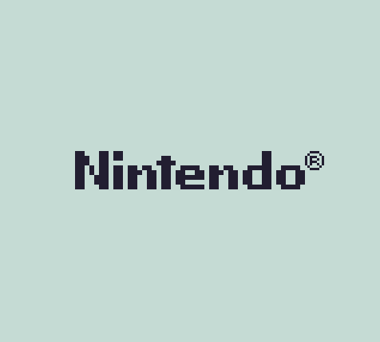
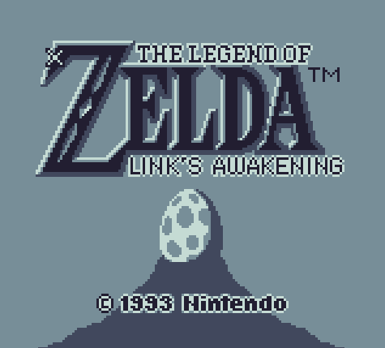

# Garboy

A Gameboy emulator made by Zach (Gar)wood



## Features

- **Accurate Emulation**: Replicates the Gameboy hardware behavior *enough* for the experience you know and love. Not 100% cycle accurate
- **Supported MBCs**: Compatible with games using:
    - MBC0 (ROM Only)
    - MBC1
    - MBC3
- **Keyboard Support**: Play with your keyboard
    - Left/Right/Up/Down = Arrow keys
    - A/B/Select/Start = X/Z/Enter/Shift

## Getting Started

### Prerequisites
- [Go](https://go.dev/doc/install) installed

### Running it
1. Clone the repository
2. Edit `main.go` to point to a ROM you've downloaded
3. `go run .`

You should see a window appear with your ROM running after this.

### Testing
1. Setup the repository following "Getting Started"
2. `go test ./test`

This will go through all of the CPU single step tests and various test ROMs.

## Screenshots
     

## Gameplay

     

## Compatibility


dmg-acid2 passes, Blargg's cpu_instrs passes and some mooneye tests pass. Here are a full list of the test ROMs I used. Thankfully it didn't need to be super accurate :)
```
    --- PASS: TestRoms/01-special.gb (6.34s)
    --- PASS: TestRoms/02-interrupts.gb (6.45s)
    --- PASS: TestRoms/03-op_sp,hl.gb (6.35s)
    --- PASS: TestRoms/04-op_r,imm.gb (6.42s)
    --- PASS: TestRoms/05-op_rp.gb (6.53s)
    --- PASS: TestRoms/06-ld_r,r.gb (6.35s)
    --- PASS: TestRoms/07-jr,jp,call,ret,rst.gb (6.31s)
    --- PASS: TestRoms/08-misc_instrs.gb (6.35s)
    --- PASS: TestRoms/09-op_r,r.gb (6.40s)
    --- PASS: TestRoms/10-bit_ops.gb (6.40s)
    --- PASS: TestRoms/11-op_a,(hl).gb (6.42s)
    --- FAIL: TestRoms/instr_timing.gb (6.40s)
    --- PASS: TestRoms/daa.gb (0.03s)
    --- FAIL: TestRoms/ie_push.gb (0.01s)
    --- PASS: TestRoms/mem_oam.gb (0.01s)
    --- PASS: TestRoms/reg_f.gb (0.01s)
    --- FAIL: TestRoms/hblank_ly_scx_timing-GS.gb (0.01s)
    --- FAIL: TestRoms/intr_1_2_timing-GS.gb (0.01s)
    --- FAIL: TestRoms/intr_2_0_timing.gb (0.01s)
    --- FAIL: TestRoms/intr_2_mode0_timing.gb (0.01s)
    --- FAIL: TestRoms/intr_2_mode0_timing_sprites.gb (0.01s)
    --- FAIL: TestRoms/intr_2_mode3_timing.gb (0.01s)
    --- FAIL: TestRoms/intr_2_oam_ok_timing.gb (0.01s)
    --- FAIL: TestRoms/lcdon_timing-GS.gb (0.01s)
    --- FAIL: TestRoms/lcdon_write_timing-GS.gb (0.02s)
    --- FAIL: TestRoms/stat_irq_blocking.gb (0.01s)
    --- FAIL: TestRoms/stat_lyc_onoff.gb (0.01s)
    --- FAIL: TestRoms/vblank_stat_intr-GS.gb (0.01s)
    --- PASS: TestRoms/div_write.gb (0.04s)
    --- FAIL: TestRoms/rapid_toggle.gb (0.01s)
    --- PASS: TestRoms/tim00.gb (0.01s)
    --- FAIL: TestRoms/tim00_div_trigger.gb (0.01s)
    --- PASS: TestRoms/tim01.gb (0.01s)
    --- FAIL: TestRoms/tim01_div_trigger.gb (0.01s)
    --- PASS: TestRoms/tim10.gb (0.01s)
    --- FAIL: TestRoms/tim10_div_trigger.gb (0.01s)
    --- PASS: TestRoms/tim11.gb (0.01s)
    --- FAIL: TestRoms/tim11_div_trigger.gb (0.01s)
    --- FAIL: TestRoms/tima_reload.gb (0.01s)
    --- FAIL: TestRoms/tima_write_reloading.gb (0.01s)
    --- FAIL: TestRoms/tma_write_reloading.gb (0.01s)
```
## Limitations
- **No Audio**: Top of my list to implement one day
- **No Settings**: Every game will be a nice shade of blue unless you modify the code. There's no speeding it up - gotta play the old fashioned way!
- **No GBC Support**: Who needs more than 4 shades of blue?

## Special Thanks
- Blargg for the [cpu_instrs](https://github.com/retrio/gb-test-roms) test ROMs
- [SingleStepTests](https://github.com/SingleStepTests/sm83) for helping me confirm my CPU was sound
- Mooneye for various (timer, PPU, MBC) [test ROMs](https://github.com/Gekkio/mooneye-test-suite)
- Matt Currie for the dmg-acid2 test ROM [:)](https://github.com/mattcurrie/dmg-acid2?tab=readme-ov-file)

## Disclaimer
This was made for educational purposes only.

<sub><sup>pls don't sue me Nintendo</sup></sub>
